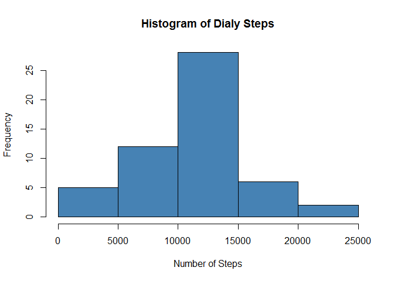
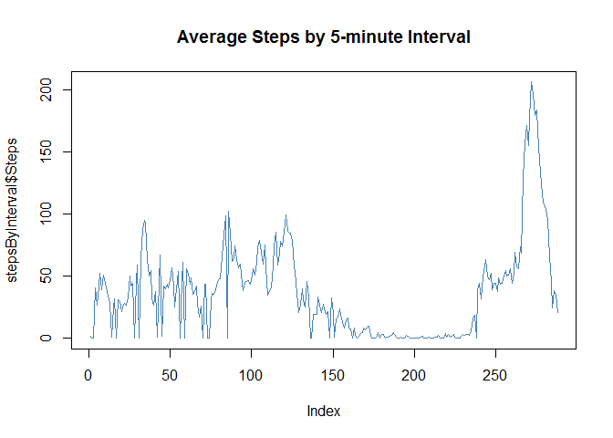
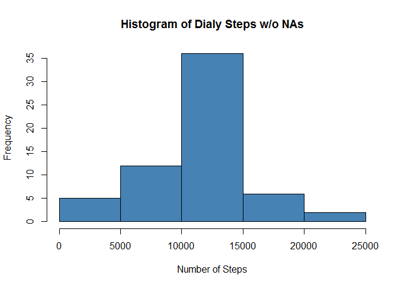

# Reproducible Research: Peer Assessment 1
Ignacio Trujillo  
Sunday, February 15, 2015  

### Basic settings

```r
echo = TRUE  # Always make code visible
options(scipen = 1)  # Turn off scientific notations for numbers
```

### Loading and preprocessing the data

1. Load the data (i.e. `read.csv()`)

2. Process/transform the data (if necessary) into a format suitable for your analysis


```r
fileUrl <- "https://d396qusza40orc.cloudfront.net/repdata%2Fdata%2Factivity.zip"
destFile <- "activity.zip"
unzippedFile <- "activity.csv"
if(!file.exists(destFile)){download.file(fileUrl,destfile = destFile)}
if(!file.exists(unzippedFile)){unzip(destFile) }
data <- read.csv("activity.csv", colClasses = c("integer", "Date", "factor"))
data$month <- as.numeric(format(data$date, "%m"))
noNA <- na.omit(data)
rownames(noNA) <- 1:nrow(noNA)
```


### What is mean total number of steps taken per day?

For this part of the assignment, you can ignore the missing values in the dataset.

1. Make a histogram of the total number of steps taken each day

```r
library("plyr")
stepsByDate <- ddply(data,~date,summarise,steps=sum(steps))
hist(stepsByDate$steps, 
     col= "steelblue", 
     main = "Histogram of Dialy Steps",
     xlab = "Number of Steps")
```

 

2. Calculate and report the mean and median total number of steps taken per day

Mean total number of steps taken per day:

```r
mean(stepsByDate$steps,na.rm=TRUE)
```

```
## [1] 10766.19
```
Median total number of steps taken per day:

```r
median(stepsByDate$steps,na.rm=TRUE)
```

```
## [1] 10765
```

### What is the average daily activity pattern?
1. Make a time series plot (i.e. type = "l") of the 5-minute interval (x-axis) and the average number of steps taken, averaged across all days (y-axis)


```r
stepsByInterval <- ddply(data,~interval,summarise,Steps=mean(steps,na.rm=TRUE))
plot(stepsByInterval$Steps,
     type = "l",
     main = "Average Steps by 5-minute Interval",
     col="steelBlue")
```

 

2. Which 5-minute interval, on average across all the days in the dataset, contains the maximum number of steps?

```r
stepsByInterval[stepsByInterval$Steps == max(stepsByInterval$Steps),]
```

```
##     interval    Steps
## 272      835 206.1698
```

### Imputing missing values
1. Calculate and report the total number of missing values in the dataset (i.e. the total number of rows with NAs):


```r
sum(is.na(data))
```

```
## [1] 2304
```

There are 2304 missing values.

2. Devise a strategy for filling in all of the missing values in the dataset. The strategy does not need to be sophisticated. For example, you could use the mean/median for that day, or the mean for that 5-minute interval, etc.

- My strategy is to use the mean for that 5-minute interval to fill each NA value in the steps column.

3. Create a new dataset that is equal to the original dataset but with the missing data filled in.


```r
newData <- data 
for (i in 1:nrow(newData)) {
  if (is.na(newData$steps[i])) {
    newData$steps[i] <- stepsByInterval[which(newData$interval[i] == stepsByInterval$interval), ]$Steps
  }
}

head(newData)
```

```
##       steps       date interval month
## 1 1.7169811 2012-10-01        0    10
## 2 0.3396226 2012-10-01        5    10
## 3 0.1320755 2012-10-01       10    10
## 4 0.1509434 2012-10-01       15    10
## 5 0.0754717 2012-10-01       20    10
## 6 2.0943396 2012-10-01       25    10
```

```r
sum(is.na(newData))
```

```
## [1] 0
```

Now there is 0 registries with NA values.

4. Make a histogram of the total number of steps taken each day and Calculate and report the *mean* and *median* total number of steps taken per day. 


```r
newStepsByDate <- ddply(newData,~date,summarise,steps=sum(steps))
hist(newStepsByDate$steps, 
     col= "steelblue", 
     main = "Histogram of Dialy Steps w/o NAs",
     xlab = "Number of Steps")
```

 

Mean total number of steps taken per day:

```r
newTotalSteps <- aggregate(newData$steps, 
                           list(Date = newData$date), 
                           FUN = "sum")$x
newMean <- mean(newTotalSteps)
newMean
```

```
## [1] 10766.19
```
Median total number of steps taken per day:

```r
newMedian <- median(newTotalSteps)
newMedian
```

```
## [1] 10766.19
```


* Do these values differ from the estimates from the first part of the assignment? What is the impact of imputing missing data on the estimates of the total daily number of steps?

Compare them with the two before imputing missing data:

```r
oldMean <- mean(stepsByDate$steps,na.rm=TRUE)
oldMedian <- median(stepsByDate$steps,na.rm=TRUE)
newMean - oldMean
```

```
## [1] 0
```

```r
newMedian - oldMedian
```

```
## [1] 1.188679
```

When adding the missing data with the mean of the 5-minute interval, the new mean of total steps is the same but the median became grater that the one without the substitution of NAs.

### Are there differences in activity patterns between weekdays and weekends?

1. Create a new factor variable in the dataset with two levels -- "weekday" and "weekend" indicating whether a given date is a weekday or weekend day.


```r
head(newData)
```

```
##       steps       date interval month
## 1 1.7169811 2012-10-01        0    10
## 2 0.3396226 2012-10-01        5    10
## 3 0.1320755 2012-10-01       10    10
## 4 0.1509434 2012-10-01       15    10
## 5 0.0754717 2012-10-01       20    10
## 6 2.0943396 2012-10-01       25    10
```

```r
newData$weekdays <- factor(format(newData$date, "%A"))
levels(newData$weekdays)
```

```
## [1] "domingo"   "jueves"    "lunes"     "martes"    "miércoles" "sábado"   
## [7] "viernes"
```

```r
#Since my versión of R is in spanish, I also consider the spanish names of the days
levels(newData$weekdays) <- list(weekday = c("Monday", "Tuesday","Wednesday","Thursday", "Friday",
                                             "lunes","martes","miércoles","jueves","viernes"),
                                 weekend = c("Saturday", "Sunday",
                                             "sábado","domingo"))
levels(newData$weekdays)
```

```
## [1] "weekday" "weekend"
```

```r
table(newData$weekdays)
```

```
## 
## weekday weekend 
##   12960    4608
```

2. Make a panel plot containing a time series plot (i.e. type = "l") of the 5-minute interval (x-axis) and the average number of steps taken, averaged across all weekday days or weekend days (y-axis).


```r
avgSteps <- aggregate(newData$steps, 
                      list(interval = as.numeric(as.character(newData$interval)), 
                           weekdays = newData$weekdays),
                      FUN = "mean")
names(avgSteps)[3] <- "meanOfSteps"
library(lattice)
xyplot(avgSteps$meanOfSteps ~ avgSteps$interval | avgSteps$weekdays, 
       layout = c(1, 2), type = "l", 
       xlab = "Interval", ylab = "Number of steps")
```

 
